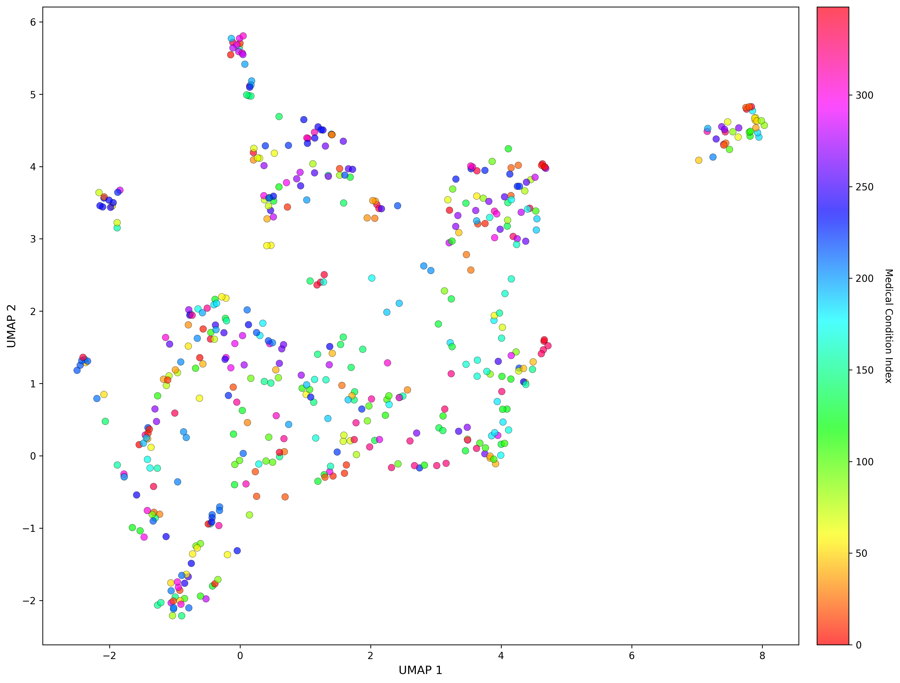
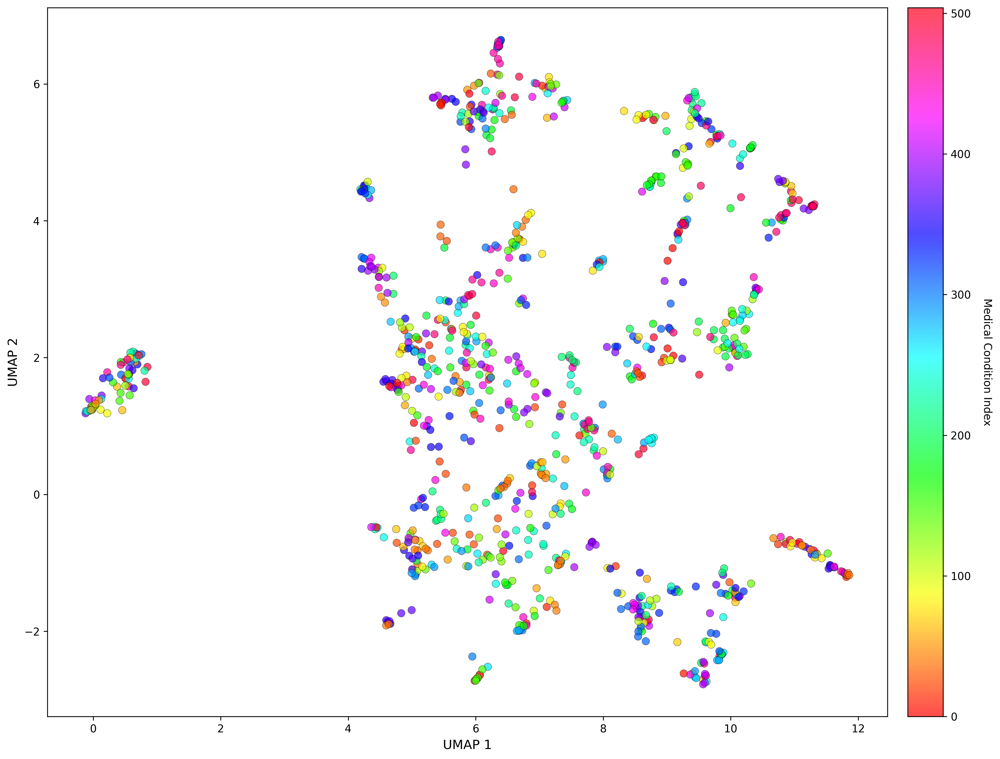
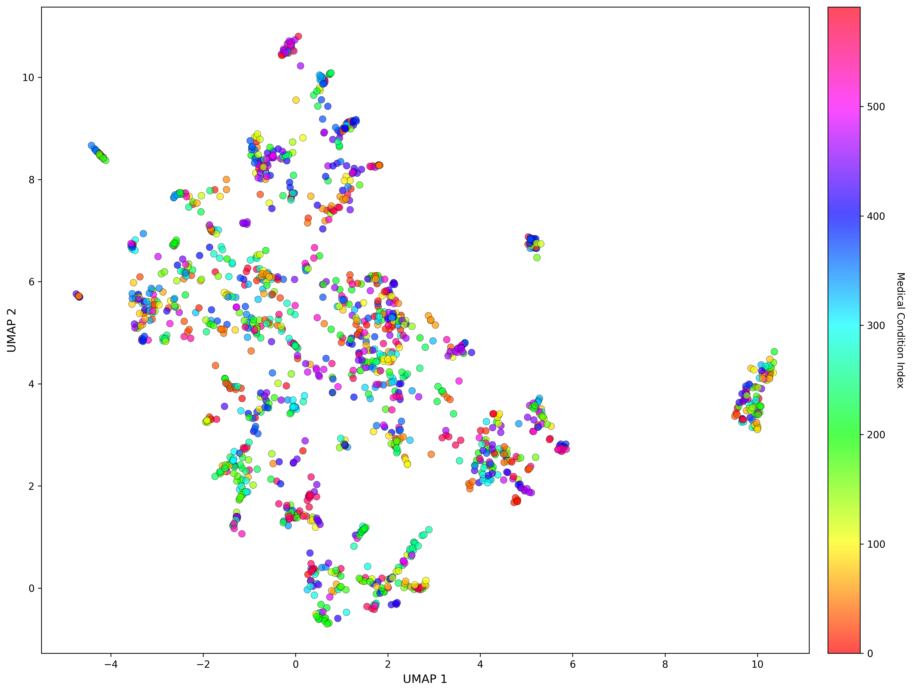
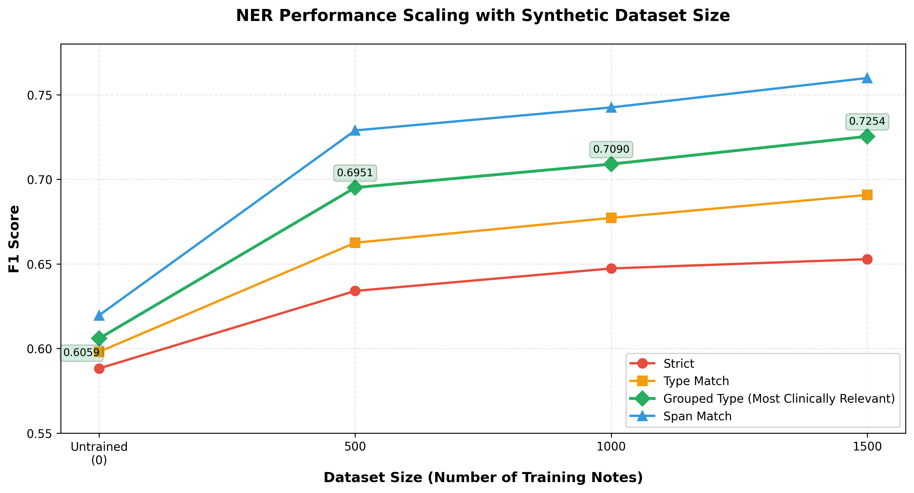

# Pipeline Scalability

The SynGP500 generation framework demonstrates robust scalability beyond the initial 500-note release. To validate that the synthetic data generation pipeline maintains quality at scale, we analyzed semantic diversity through UMAP embeddings and evaluated NER performance using MedCAT on progressively larger synthetic datasets.

## I. Semantic Diversity at Scale

Embedding space coverage using UMAP dimensionality reduction on all-mpnet-base-v2 embeddings across dataset sizes.

<table>
<tr>
<td width="33%" align="center">

**500 Notes**

</td>
<td width="33%" align="center">

**1000 Notes**

</td>
<td width="33%" align="center">

**1500 Notes**

</td>
</tr>
</table>

**Key Observation:** UMAP visualizations show continued semantic diversity as the dataset scales, with richer coverage at larger sizes.

## II. NER benchmark

**Note:** The 1000→1500 note expansion used different generation parameters.

### Detailed Results Across Dataset Sizes

| Strategy | Untrained | 500 Notes | 1000 Notes | 1500 Notes | Total Gain |
|----------|-----------|-----------|------------|------------|------------|
| **Grouped Type** (Most Clinically Relevant) | 0.6059 | **0.6951** | **0.7090** | **0.7254** | **+19.7%** |
| **Span Match** | 0.6196 | 0.7289 | 0.7425 | 0.7599 | +22.7% |
| **Type Match** | 0.5980 | 0.6625 | 0.6772 | 0.6908 | +15.5% |
| **Strict** | 0.5882 | 0.6340 | 0.6473 | 0.6528 | +11.0% |

## Key Findings

✅ **Consistent performance improvements** across all evaluation strategies as dataset size increases

✅ **Quality maintenance at scale**: The generation pipeline produces synthetic notes with continued learning signal at larger dataset size

---

[← Back to main README](../../README.md)
