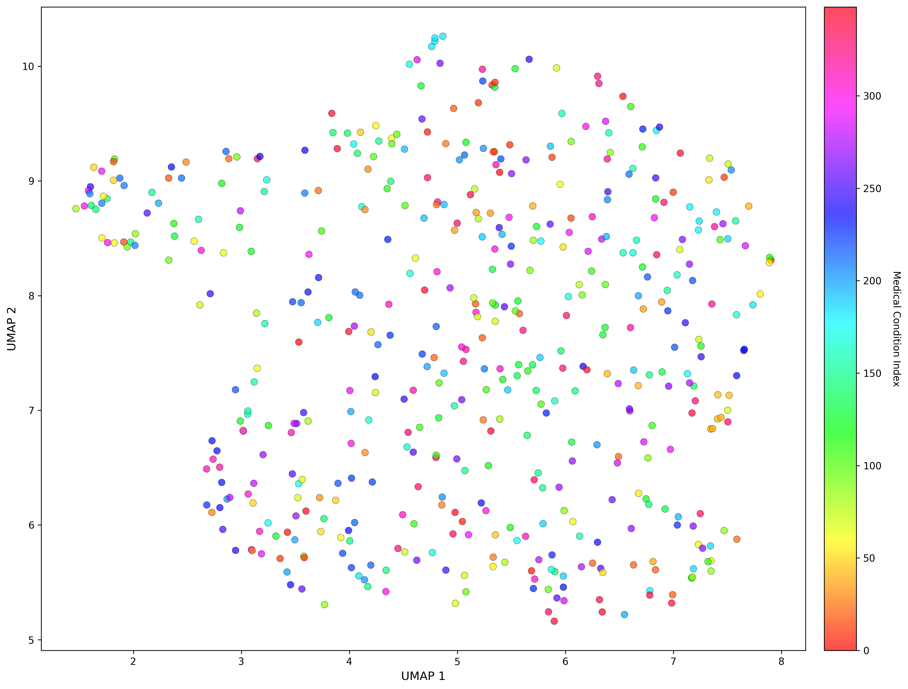
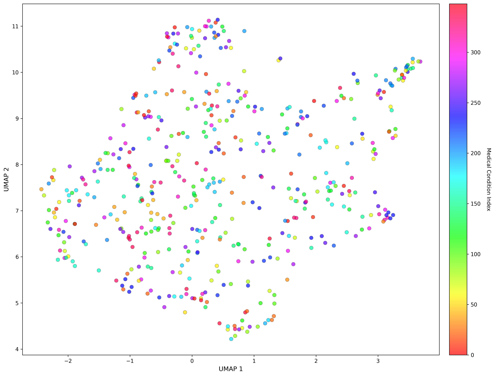
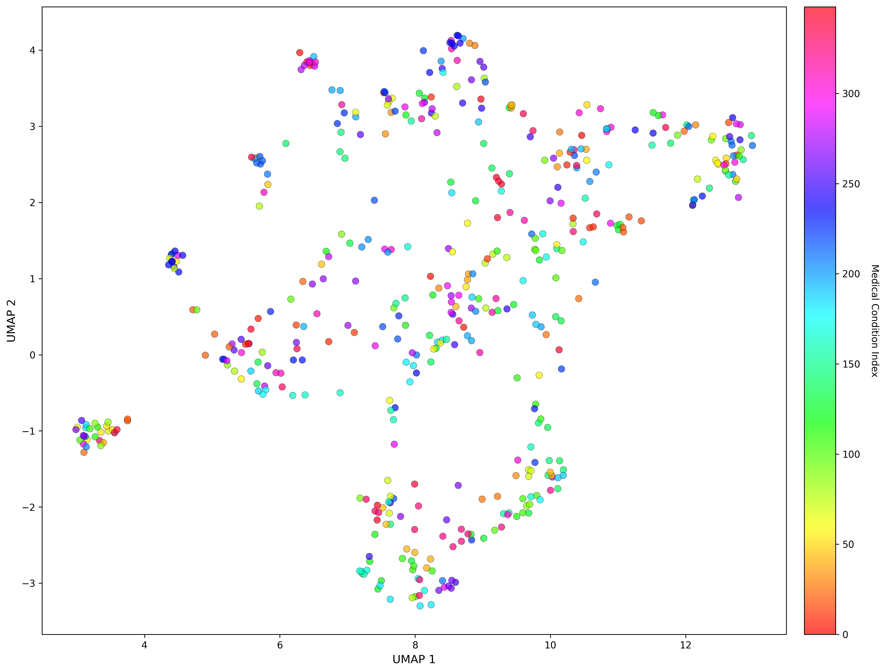
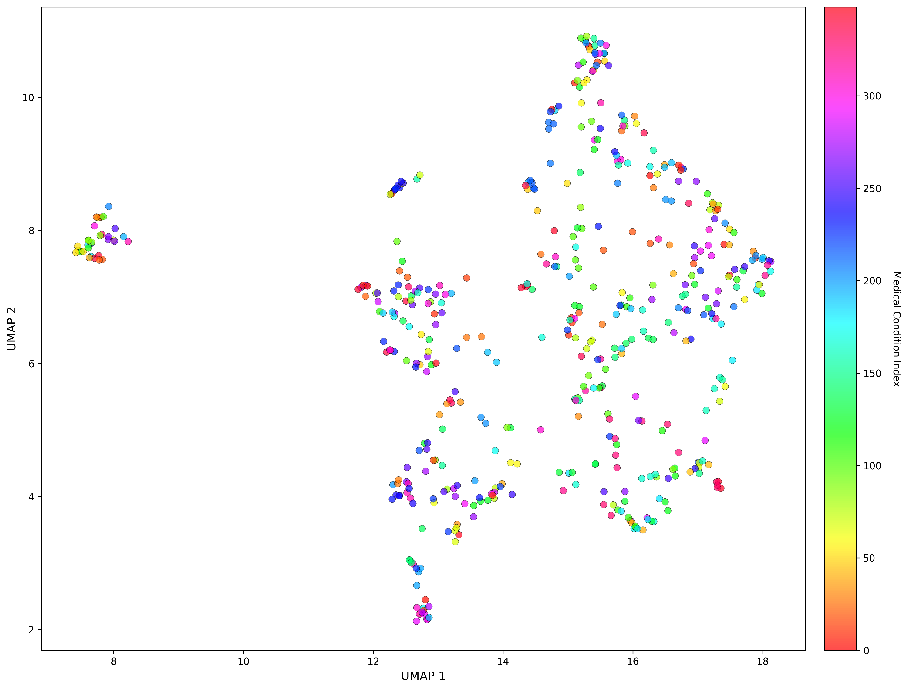

# Semantic Diversity Analysis

Semantic diversity analysis demonstrates that SynGP500 exhibits broad distribution across the embedding space, providing evidence against mode collapse typical of naïve LLM generation.

## Embedding Methodology

Note-level embeddings were generated using multiple embedding models:
- **all-mpnet-base-v2** - General-purpose sentence transformer [1]
- **ModernBERT** - Recent efficient transformer architecture [2]
- **Clinical ModernBERT** - Domain-adapted variant fine-tuned on clinical text [3]

For notes exceeding the 512-token model context limit (all-mpnet-base-v2), embeddings were computed by averaging representations from the first and last 512 tokens.

## Analysis Metrics

| Metric | Value | Interpretation |
|--------|-------|----------------|
| **Cosine Similarity (mean)** | 0.52 | Moderate document-to-document similarity |
| **Cosine Similarity (range)** | 0.09–0.95 | Broad distribution from highly dissimilar to highly similar notes |
| **UMAP Dimensionality Reduction** | Visual clustering by condition | Natural semantic grouping without excessive overlap |

## UMAP Visualization

UMAP (Uniform Manifold Approximation and Projection) dimensionality reduction reveals the embedding space structure across multiple embedding models:

<table>
<tr>
<td width="33%">

**ModernBERT**

</td>
<td width="33%">

**Clinical ModernBERT**

</td>
<td width="33%">

**all-mpnet-base-v2**

</td>
</tr>
</table>

**Clinical content embeddings** show natural clustering by medical condition across different embedding models.

**Final notes with persona writing style applied** (all-mpnet-base-v2)

All visualizations demonstrate absence of mode collapse, where diverse clinical scenarios occupy distinct regions of the embedding space. Application of writing styles introduces additional clustering patterns in style-sensitive embedding models, reflecting clustering of documentation approaches amongst clinicians

---

## References

1. **Reimers N, Gurevych I.** Sentence-BERT: Sentence Embeddings using Siamese BERT-Networks. *Proceedings of the 2019 Conference on Empirical Methods in Natural Language Processing and the 9th International Joint Conference on Natural Language Processing (EMNLP-IJCNLP)*. 2019. doi:10.18653/v1/D19-1410

2. **Warner B, Chaffin A, Clavié B, et al.** Smarter, Better, Faster, Longer: A Modern Bidirectional Encoder for Fast, Memory Efficient, and Long Context Finetuning and Inference. arXiv preprint arXiv:2412.13663. 2024.

3. **Lehman E, Hernandez E, Mahajan D, et al.** Do We Still Need Clinical Language Models? *Proceedings of the 3rd Machine Learning for Health Symposium*. PMLR 2023;219:578-597.

---

[← Back to main README](../../README.md)
